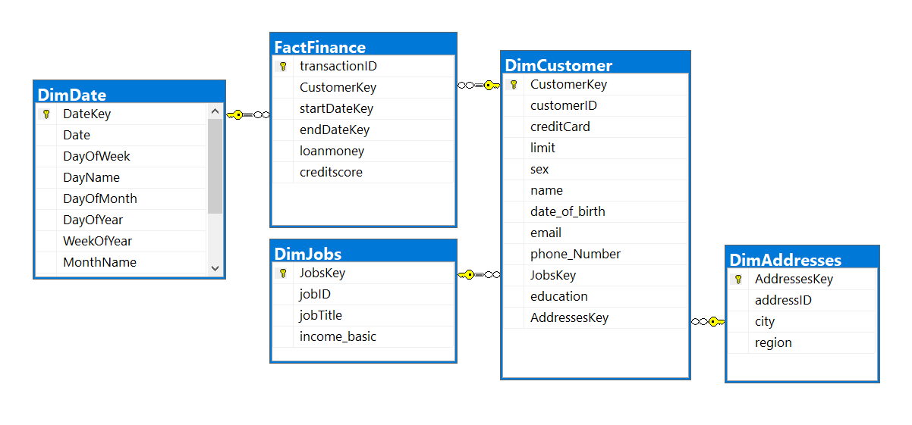

## FIRST PROJECT FA (FINANCE PROJECT)

## I. Decsription of this project

**Define the business needs:** 
Finance- We is trying to evaluate the a *consumer's creditworthiness* (based on historical financial and personal information)

**Solution:**
*We will need to aggregate data based on *transition*, *customer*, *jobs*, *addresses* and *date*. It will be evaluated based on *credit score* (historical financial and personal information)*

## II. Working data

Data is generated based on Python sript. The database (.csv flat files) will include:

1. Address.csv

	This file includes basics data for an address such as addressID, city, region.

2. Job.csv

	This file includes basics data for a job such as jobID, jobTitle, income_basic.

3. Customer.csv

	This file includes basics data for a job such as customerID, creditCard, limit, sex, firstname, lastname, date_of_birth, email, phone_Number, jobID, education, addressID.

4. Employee.csv

	This file includes basics data for an employee such as employeeID, name, date_of_birth, email, phone_Number, addressID.

5. Transaction.csv

	This file includes basics data for an transaction such as transactionID, startDate, endDate, percents, customerID, employeeID.

## III. Detail of work

1. Generate Data
    - Generate rawdata and copy to workfolder
2. Design data pipeline 
3. Design finance database 
4. Design the dimensional model schema 
    - Defined Dimensiona tables and Facts tables
    - Design logical data map: [here]()
5. Ingest data from flat file csv
    -  Design SSIS package to ETL the data
    -  Using SSIS pipe line load data to SQL Server (Fiance Database)
    -  Using SSIS stage data in SQL Server (stage)
6. Load data onto Snowflake
    -  Using SSIS load dimDate to Snowflake (1 times)
    -  Using SSIS load data from SQL Server (stage) to Snowflake
7. Visualize data using PowerBI
   - Connect Snowflake source
   - Visualize data
   -  Connect Power BI Desktop with Power BI Service

## IV. Set up
1. Install Python package generates fake data: pip install Faker
2. Login into MSSQL and run [t-sql-finance.sql](./src/mssql/t-sql-finance.sql)
3. In MSSQL  run [stage-sql-server.sql](./src/mssql/stage-sql-server.sql)
4. Download and install ODBC Driver [here](https://sfc-repo.snowflakecomputing.com/odbc/win64/latest/index.html)
5. Download and install Snowflake SSIS Component [here](https://www.cdata.com/drivers/snowflake/ssis)
6. Authen and run SnowSQL [init_snowflake.sql](./src/snowflake/init_snowflake.sql)
7. Open SSIS solution:
   - Change variable logForder with your path that you want to log rows in ETL staging process
   - Run SSIS Solution

## V. Dashboard
1. Overview : [here](https://app.powerbi.com/view?r=eyJrIjoiZmE0YTE4N2QtMTc3OC00MzJiLWJiZDQtYWE3NzE4YzE0ZTkzIiwidCI6ImYwMWU5MzBhLWI1MmUtNDJiMS1iNzBmLWE4ODgyYjVkMDQzYiIsImMiOjEwfQ%3D%3D&pageName=ReportSection)
2. Detail for rank of customer: [here](https://app.powerbi.com/view?r=eyJrIjoiZmE0YTE4N2QtMTc3OC00MzJiLWJiZDQtYWE3NzE4YzE0ZTkzIiwidCI6ImYwMWU5MzBhLWI1MmUtNDJiMS1iNzBmLWE4ODgyYjVkMDQzYiIsImMiOjEwfQ%3D%3D&pageName=ReportSection3cf65f523be593a0e166)
